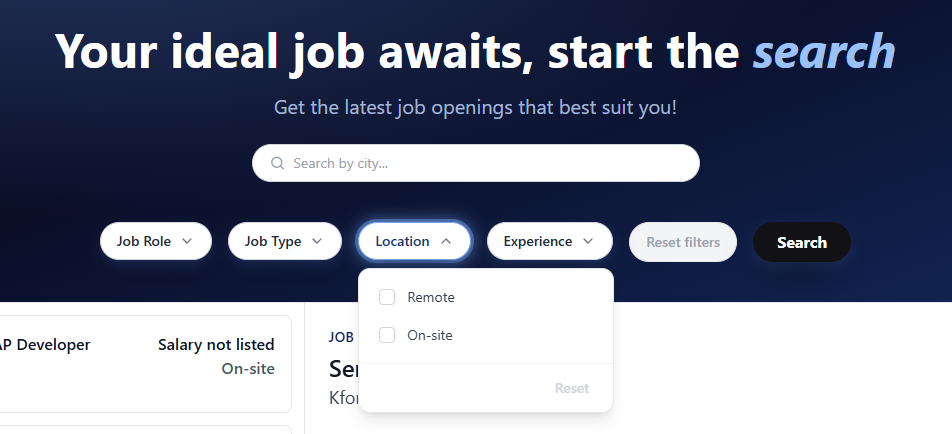
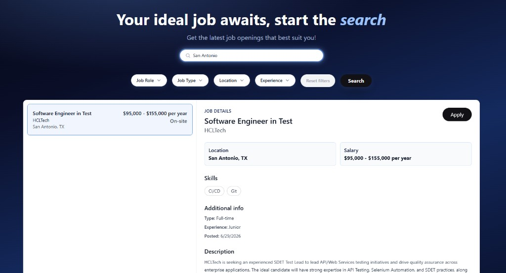

<!-- Improved compatibility of back to top link: See: https://github.com/othneildrew/Best-README-Template/pull/73 -->
<a id="readme-top"></a>

<!-- PROJECT LOGO -->
<br />
<div align="center">
  

  <p align="center">
    A clean, filterable job board that surfaces live listings pulled into Firebase from the JSearch API.
    <br />
    <a href="https://github.com/tylerrstage/JobSearch"><strong>Explore the docs »</strong></a>
    <br />
    <br />
    <a href="https://github.com/tylerrstage/JobSearch/issues/new?labels=bug&template=bug-report---.md">Report Bug</a>
    &middot;
    <a href="https://github.com/tylerrstage/JobSearch/issues/new?labels=enhancement&template=feature-request---.md">Request Feature</a>
  </p>
</div>


<!-- TABLE OF CONTENTS -->
<details>
  <summary>Table of Contents</summary>
  <ol>
    <li>
      <a href="#about-the-project">About The Project</a>
      <ul>
        <li><a href="#built-with">Built With</a></li>
      </ul>
    </li>
    <li>
      <a href="#getting-started">Getting Started</a>
      <ul>
        <li><a href="#prerequisites">Prerequisites</a></li>
        <li><a href="#installation">Installation</a></li>
      </ul>
    </li>
    <li><a href="#usage">Usage</a></li>
    <li><a href="#project-structure">Project Structure</a></li>
    <li><a href="#roadmap">Roadmap</a></li>
    <li><a href="#contact">Contact</a></li>
  </ol>
</details>


<!-- ABOUT THE PROJECT -->
## About The Project

[![Product Name Screen Shot][product-screenshot]](https://github.com/tylerrstage/JobSearch)

JobSearch is a job board web app built to make browsing openings feel effortless. Jobs are searched and filtered client-side by role, employment type, workplace (remote/on-site), experience level, and city, with a two-pane layout: a scrollable list of results on the left and a detail panel on the right showing the full description, skills, salary, and an apply link.

Rather than hand-entering listings, job data is sourced from the [JSearch API](https://rapidapi.com/letscrape-6bRBa3QguO5/api/jsearch) and imported into a Firebase Firestore database via a small Node import script. The React front end then reads directly from Firestore, so the app stays fast and works without hitting a third-party API on every page load.

Key features:
* **Multi-select filters** for job role, job type, location (remote/on-site), and experience level
* **City search** to narrow results to a specific area
* **Sticky detail panel** with an expandable "Read more" description, skills list, salary, and a direct apply link
* **Firestore-backed data** with a reusable import script for pulling in fresh listings from JSearch
* **Fallback dummy data** so the UI renders immediately, even before Firestore has been seeded

<p align="right">(<a href="#readme-top">back to top</a>)</p>


### Built With

* [![React][React.js]][React-url]
* [![Vite][Vite.js]][Vite-url]
* [![Tailwind CSS][Tailwind.css]][Tailwind-url]
* [![Firebase][Firebase.com]][Firebase-url]

<p align="right">(<a href="#readme-top">back to top</a>)</p>


<!-- GETTING STARTED -->
## Getting Started

To get a local copy up and running, follow these steps.

### Prerequisites

* Node.js (v18 or later recommended) and npm
  ```sh
  npm install npm@latest -g
  ```
* A [Firebase](https://firebase.google.com/) project with Firestore enabled
* A [JSearch API](https://rapidapi.com/letscrape-6bRBa3QguO5/api/jsearch) key (only needed if you want to import fresh job listings)

### Installation

1. Clone the repo
   ```sh
   git clone https://github.com/tylerrstage/JobSearch.git
   cd JobSearch/job-portal
   ```
2. Install NPM packages
   ```sh
   npm install
   ```
3. Set up your Firebase client config. Create `src/firebase.config.js` (this file is gitignored) and export an initialized Firestore instance:
   ```js
   import { initializeApp } from 'firebase/app';
   import { getFirestore } from 'firebase/firestore';

   const firebaseConfig = {
     apiKey: 'YOUR_API_KEY',
     authDomain: 'YOUR_PROJECT.firebaseapp.com',
     projectId: 'YOUR_PROJECT_ID',
     storageBucket: 'YOUR_PROJECT.appspot.com',
     messagingSenderId: 'YOUR_SENDER_ID',
     appId: 'YOUR_APP_ID',
   };

   const app = initializeApp(firebaseConfig);
   export const db = getFirestore(app);
   ```
4. (Optional) To use the job import script, add a `.env` file in the project root with your JSearch credentials:
   ```
   JSEARCH_API_KEY=your_api_key_here
   JSEARCH_API_URL=https://api.openwebninja.com/jsearch/search-v2
   ```
   and download a Firebase service account key from your Firebase project settings, saving it as `src/backend/firebase/serviceAccountKey.json` (also gitignored).
5. Start the dev server
   ```sh
   npm run dev
   ```

<p align="right">(<a href="#readme-top">back to top</a>)</p>


<!-- USAGE EXAMPLES -->
## Usage

Once running, the app loads job listings from Firestore (falling back to sample data if none are found) and displays them in a searchable, filterable list.

* Use the **city search bar** to narrow results to a specific city, then press Enter or click Search.
* Use the **filter pills** (Job Role, Job Type, Location, Experience) to multi-select criteria; results update when you click Search.
* Click **Reset filters** to clear all active filters and city search in one click.
* Click any job card to view its full details, including skills, salary, and an **Apply** button that links out to the original posting.

<p align="center">
  
</p>

Each filter dropdown supports multiple selections at once, so you can, for example, look for both Frontend and Full Stack roles that are Remote in a single search.

<p align="center">
  
</p>

Combine the city search with filters to quickly narrow a large result set down to a handful of relevant openings.

To pull in a fresh batch of listings from JSearch and store them in Firestore, run:

```sh
npm run jsearch
```

This runs `src/backend/firebase/jsearch.js`, which queries the JSearch API, normalizes each listing (location, salary formatting, derived experience level, extracted skills), and upserts the results into the `jobs` collection in Firestore.

<p align="right">(<a href="#readme-top">back to top</a>)</p>


<!-- PROJECT STRUCTURE -->
## Project Structure

```
job-portal/
├─ src/
│  ├─ components/
│  │  ├─ Navbar/            # Top navbar
│  │  ├─ Header/             # Hero heading/subheading
│  │  ├─ CitySearch/         # City search input
│  │  ├─ Searchbar/          # Filter dropdowns, search & reset controls
│  │  ├─ JobCard/             # Job summary card in the results list
│  │  └─ JobDetailPanel/     # Expanded job details / apply panel
│  ├─ backend/firebase/
│  │  └─ jsearch.js          # Node script: JSearch API -> Firestore import
│  ├─ utils/location.js      # Location parsing/matching helpers
│  ├─ JobDummyData.js        # Fallback sample data
│  └─ App.jsx                # Top-level layout, state, and Firestore fetch/filter logic
└─ public/
```

<p align="right">(<a href="#readme-top">back to top</a>)</p>


<!-- ROADMAP -->
## Roadmap

- [ ] Server-side pagination for large result sets
- [ ] Saved/favorited jobs
- [ ] Automated scheduled job imports (e.g. via Firebase Cloud Functions)
- [ ] User accounts and applied-job tracking

See the [open issues](https://github.com/tylerrstage/JobSearch/issues) for a full list of proposed features (and known issues).

<p align="right">(<a href="#readme-top">back to top</a>)</p>


<!-- CONTACT -->
## Contact

Tyler Stageberg - tyler.stageberg@gmail.com

Project Link: [https://github.com/tylerrstage/JobSearch](https://github.com/tylerrstage/JobSearch)

<p align="right">(<a href="#readme-top">back to top</a>)</p>


<!-- MARKDOWN LINKS & IMAGES -->
[product-screenshot]: images/app-overview.png
[React.js]: https://img.shields.io/badge/React-20232A?style=for-the-badge&logo=react&logoColor=61DAFB
[React-url]: https://reactjs.org/
[Vite.js]: https://img.shields.io/badge/Vite-646CFF?style=for-the-badge&logo=vite&logoColor=white
[Vite-url]: https://vite.dev/
[Tailwind.css]: https://img.shields.io/badge/Tailwind_CSS-38B2AC?style=for-the-badge&logo=tailwind-css&logoColor=white
[Tailwind-url]: https://tailwindcss.com/
[Firebase.com]: https://img.shields.io/badge/Firebase-FFCA28?style=for-the-badge&logo=firebase&logoColor=black
[Firebase-url]: https://firebase.google.com/
